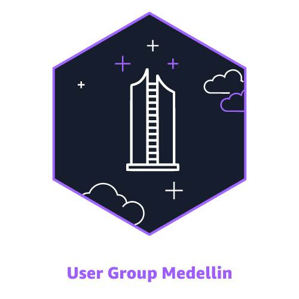
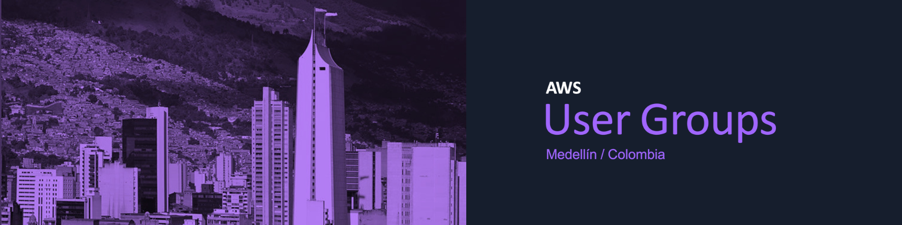

# AWS User Group Medellín - Assets Repository ☁️

Welcome to the **AWS User Group Medellín** Assets Repository!

Here, we proudly share all our group’s official logos, presentation templates, and visual assets. Whether you're looking to represent our community or want resources for your AWS projects, you've come to the right place. 🎉

## 🖼️ What You'll Find Here

Explore a variety of resources to help you support and showcase our AWS User Group community:

- **logos**: Find official logos in different formats for your presentations and projects.
- **presentations**: Access templates and slides used in our meetups and events.
- **additional_assets**: Other fun and useful resources, such as icons, social media assets, and branding guidelines!

## 🚀 Getting Started

1. **Clone** this repository to access the files locally:

   ```bash
   git clone https://github.com/awsugmed/assets.git
   ```

2. **Use** the assets responsibly! They're here to spread the word about AWS and our Medellín community.
3. **Contribute**: If you’d like to add to our assets or improve existing files, feel free to fork, update, and open a pull request. We welcome your ideas!

## 🎨 Asset Previews

Here's a sneak peek of some of our assets! Check out the folders to find what you need:

- **Logos:** This is our official AWS UG Medellín logo!

 <br>

- **Icons & Social Media Graphics:** Share the AWS love on all platforms.

 <br>

## 🛠️ Admins & Maintainers

Our team of dedicated AWS Enthusiasts keeps this repository updated and running! For any questions, reach out to us:

- **Alejandro Mendoza** - [amendozafor](https://github.com/amendozafor)
- **Anderson Londoño** - [londoso](https://github.com/londoso)
- **David Arias** - [devarias](https://github.com/devarias)
- **Lorena Jimenez** - [lorejimenez117](https://github.com/lorejimenez117)
- **Santiago Garcia Arango** - [san99tiago](https://github.com/san99tiago)

---

We’re thrilled to see the amazing things you create with these assets! Happy building, and let’s keep growing our AWS Medellín community! 🌐

## ⚖️ License

This repository is licensed under the **MIT License**, meaning you’re free to use and share the assets, as long as you attribute back to us! For more details, check the [LICENSE](LICENSE) file.
